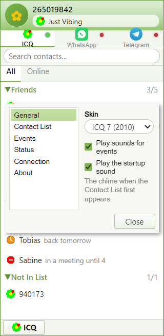

<div align="center">
  
  <h1>ISeekU</h1>
  <p>
    ICQ, rebuilt. Numeric UINs, the Contact List, the eight Statuses.<br/>
    Speaks XMPP, so it reaches the <a href="https://icqr.net">icqr.net</a> network —
    and brings WhatsApp and Telegram along.
  </p>

  
  
  
  
  
</div>

---

<div align="center">
  
  &nbsp;&nbsp;
  
</div>

<div align="center">
  <em>Contact List and Status menu, in the ICQ 7 skin</em>
</div>

<br/>

<div align="center">
  
</div>

<div align="center">
  <em>A conversation. Every screenshot here is generated from the running
  application by <code>npm run screenshots</code> — none are mock-ups.</em>
</div>

---

## What it is

Numeric UINs, the Contact List with its Groups and status icons, all eight
Statuses including Free For Chat and Invisible, Away Messages, Authorization
requests, and a permanent local Message Archive.

Underneath it is XMPP, so it talks to the network where the UINs actually are —
and to any other Jabber server, which the original could never do.

**Three accounts, side by side:**

| | |
|---|---|
| **ICQ** | The native one. XMPP, against icqr.net or any other server |
| **WhatsApp** | Inherited from the project this is forked from |
| **Telegram** | Same |

WhatsApp and Telegram were the whole point of the upstream project and are kept
working here, untouched — they appear as their own tabs beside ICQ. See
[ADR 0003](docs/adr/0003-whatsapp-and-telegram-stay-as-extra-transports.md) for
why they stayed.

Forked from [Felix-Helleckes/ICQ](https://github.com/Felix-Helleckes/ICQ) (MIT).

## Two eras, both authentic

<div align="center">
  
</div>

Switch skins from the flower button or Preferences:

- **ICQ 7 (2010)** — the default. Pastel greens, 31-pixel rows with
  photographs. Colours and metrics sampled pixel-by-pixel from ICQ's own
  product screenshot.
- **ICQ Classic (2001)** — Windows 98 grey, 16-pixel rows, MS Sans Serif at
  8pt, two-ring Win32 bevels, and the pure-primary flower measured from the
  ICQ 2001b splash screen.

Both use the **native operating-system window frame**, as ICQ itself did.

Every colour in [`docs/ORIGINAL-REFERENCE.md`](docs/ORIGINAL-REFERENCE.md) is
marked either measured-from-an-original or estimated. Including one mistake
worth recording: an early version used the icq.com *website* palette of 2006
for the flower, which is six years and one design generation off.

You can add your own — see [`docs/THEMES.md`](docs/THEMES.md).

## Status

**Working:** signing in, creating a UIN, the Contact List, one-to-one
messages, typing notifications, delivery receipts, Status and Status Text,
Away Messages, Alert-when-online, Preferences, themes, and a local History
that reads the archives the official ICQ Reborn client writes.

**Not yet:** User Details, Add/Find Contact, the Message Archive browser, file
transfer, avatars.

[`docs/STATUS.md`](docs/STATUS.md) is what is actually done;
[`docs/ROAD_TO_ISEEKU.md`](docs/ROAD_TO_ISEEKU.md) is the backlog.

## The network

Measured against the live icqr.net service, not taken from documentation:

| | |
|---|---|
| Address | `132.145.202.182:5222`, plain TCP |
| Protocol | XMPP (RFC 6120/6121) — not OSCAR |
| XMPP domain | `132.145.202.182`, the IP literal itself |
| JID | `<UIN>@132.145.202.182` |
| Encryption | **none** — the server advertises no STARTTLS |
| SASL | `PLAIN` only |
| Registration | XEP-0077 open |

### Read this part

**The icqr.net server does not encrypt anything.** Your password, and every
message you send, cross the network in a form anyone on the path can read.

ISeekU will not connect to such a server unless you say so, every session. The
refusal happens after the server has described itself and *before* your
password reaches the socket, and an account connected in the clear stays
visibly marked for as long as it is signed in. There is no "do not show this
again", on purpose.

Where a server does offer encryption, ISeekU uses it and prefers SCRAM over
PLAIN. A server that offered encryption last time and stops is refused outright
rather than accepted quietly.

Your password is stored via Electron `safeStorage` (DPAPI on Windows, Keychain
on macOS, libsecret on Linux) and never travels back out of the main process.

### On Android

There is no Android build, and that is deliberate rather than pending. Electron
does not run there, and the XMPP layer is Node code in the main process.

You do not need one: icqr.net speaks standard XMPP, so any XMPP client reaches
it. [Conversations](https://f-droid.org/packages/eu.siacs.conversations/) from
F-Droid works — add the account `<your UIN>@132.145.202.182`, and allow the
unencrypted connection when it asks. The same warning above applies.

## Running it

```bash
npm install
```

```bash
npm start
```

### Without an account

Look at the interface with a demo Contact List, no sign-in and no network:

```bash
npm run demo
```

Regenerate the screenshots in this README:

```bash
npm run screenshots
```

### Talking to a server directly

Ask a server what it supports:

```bash
node tools/probe-server.js --uin YOUR_UIN --server 132.145.202.182 --out server-probe.json
```

Sign in and watch what arrives:

```bash
node tools/icq-smoke.js --uin YOUR_UIN --server 132.145.202.182 --insecure --seconds 90
```

Both prompt for the password, store nothing, and keep it out of their logs.
`--insecure` is required for icqr.net, and the run says why.

### Tests

```bash
npm run test:electron
```

```bash
npm run test:unit
```

```bash
npm run check:transports
```

The last one walks every seam of all three accounts — bridge file, IPC
handlers, the `window.api` surface, the renderer branches — and fails if one
has been disconnected. The ICQ work touched every file that dispatches on which
account a chat belongs to, and it is entirely possible to break WhatsApp
without a single other test noticing.

## How it is put together

```
electron/lib/icq-*.js     the domain rules — Statuses, Contacts, History, the
                          security gate, theme validation. No I/O, fully tested.
electron/icq/             the part that talks to a socket: connection,
                          registration, and the account facade.
electron/main.js          IPC, in one icq:* / wa:* / tg:* pattern.
src/skins/                icq78.css and icq99.css — the two eras.
src/components/icq/       Contact List, sign-in, flower menu, Status menu,
                          Preferences, status icons.
```

[`CONTEXT.md`](CONTEXT.md) defines the vocabulary — the interface says "Contact
List", never "roster". [`docs/adr/`](docs/adr/) records the decisions that are
hard to reverse and would otherwise look like mistakes.

## Credits and licence

MIT, as inherited. Built on
[Felix-Helleckes/ICQ](https://github.com/Felix-Helleckes/ICQ) by Felix
Helleckes, whose WhatsApp and Telegram bridges are still doing the work here.

Not affiliated with ICQ, its former owners, or the icqr.net project. The
interface is an original recreation: no ICQ artwork is redistributed, and the
status icons are drawn from scratch.
