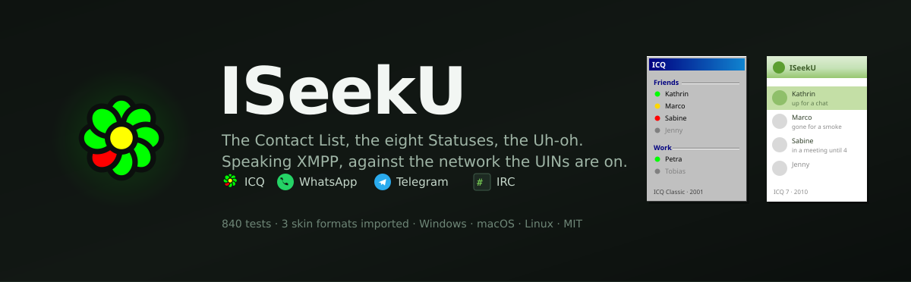
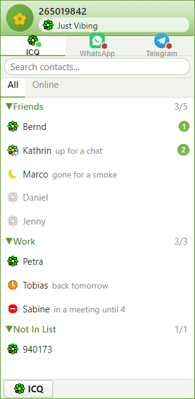
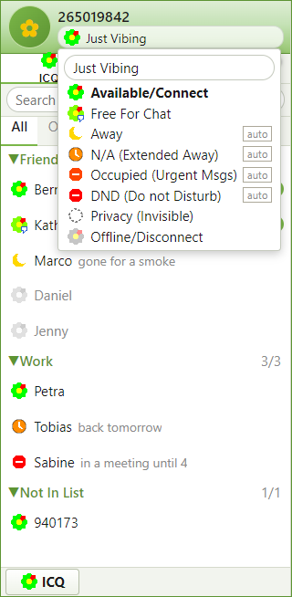
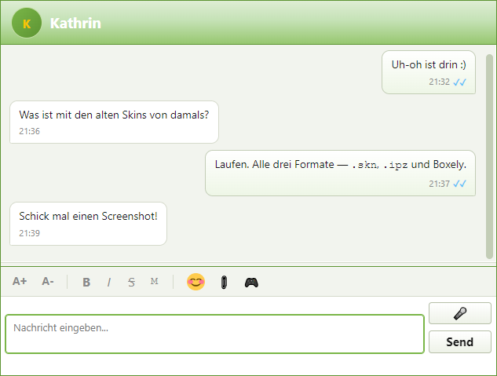

<div align="center">
  
</div>

<div align="center">

[](https://www.electronjs.org/)
[](https://react.dev/)
[](https://xmpp.org/rfcs/rfc6120.html)
[](#tests)
[](LICENSE)

</div>

---

## It looks like this

<div align="center">
  
  &nbsp;&nbsp;
  
</div>

<div align="center">
  
</div>

<div align="center">
  <em>Contact List, Status menu and a conversation, in the ICQ 7 skin.<br/>
  Every screenshot here comes out of the running application via
  <code>npm run screenshots</code> — none are mock-ups, and none can go stale.</em>
</div>

---

## What it is

Numeric UINs. The Contact List with its Groups and its status icons. All eight
Statuses, including the two everyone forgets — Free For Chat, and Privacy
(Invisible). Away Messages, Authorization requests, Not In List, and a
permanent local Message Archive that reads the files the official ICQ Reborn
client writes.

Underneath it is XMPP, which is what the surviving ICQ network actually speaks.
That has a consequence the original never had: ISeekU reaches **any** XMPP
server, not just icqr.net.

**Three accounts, side by side:**

| | |
|---|---|
| **ICQ** | The native one — XMPP, against icqr.net or any other server |
| **WhatsApp** | Inherited from the project this is forked from, kept working |
| **Telegram** | Same |

WhatsApp and Telegram were the whole point of the upstream project. They are
untouched and appear as their own tabs beside ICQ —
[ADR 0003](docs/adr/0003-whatsapp-and-telegram-stay-as-extra-transports.md)
records why they stayed.

## Two eras, both measured

Switch from the flower button or Preferences. Both sit inside the **native
operating-system window frame**, as ICQ itself did — not a self-drawn one.

| | |
|---|---|
| **ICQ 7** (2010) | The default. Pastel greens, 31-pixel rows with photographs. Header gradient `#DEEDD4 → #C5E2B6 → #97C770`, sampled pixel-by-pixel from ICQ's own product shot. |
| **ICQ Classic** (2001) | Windows 98 grey, 16-pixel rows, MS Sans Serif at 8pt, two-ring Win32 bevels. `#C0C0C0` because that is `COLOR_3DFACE`; `#000080` because Windows 98's selection was navy, not XP's `#316AC5`. |

Every colour in [`docs/ORIGINAL-REFERENCE.md`](docs/ORIGINAL-REFERENCE.md) is
marked either *measured from an original* or *estimated* — including one
mistake worth recording. An early version drew the flower in `#4DAB27` and
`#FC021E`, taken from the icq.com **website** palette of 2006. The application's
own colours, measured off the 2001b splash screen, are the pure primaries
`#00FF00`, `#FF0000` and `#FFFF00`. A brand's website is not its application,
and the muted greens made the flower read six years too late.

## Skins people made twenty years ago still load

All three of ICQ's skinnable eras import, straight into `themes/`. Each was
reverse-engineered from real files off the surviving archives.

| Era | File | What it actually is |
|---|---|---|
| **ICQ Plus** (1999–2003) | `.ipz` | ZIP plus `skininfo.dat` — a binary index beginning `VE`, then `ICQPlus skin file`, then sections carrying Windows COLORREF values |
| **ICQ Lite 5** (2005) | `.skn` | An OLE Compound File — the same container as a `.doc` — holding one stream, `SkinData`, which is the serialised widget tree ICQ drew its window from |
| **ICQ 6.5 / 7** (2007–2010) | `.zip` | Boxely: XML and CSS. The only one in the lineage that is not a binary format |

**Verified against 36 real skins.** All 36 import with a palette that matches
the skin — Pro7 comes out red, Borussia Dortmund yellow, Puls 4 pink, bigmir
navy. A Winamp skin that was filed under ICQ by mistake is correctly refused.

Finding the colours is the whole difficulty, and the traps are specific:

- **Text is never a colour.** `.gif` read one byte off gives `#696608`,
  `.jpg` gives `#706701` — saturated, plausible, and completely wrong. They
  outscored the real palettes until every byte belonging to a string was
  excluded first.
- **Colours come in runs**, and where two readings overlap the longer wins. A
  row of `C0 C0 C0 00` read one byte late parses just as validly as `#C0C000`.
- **Comments are stripped before anything is read.** Boxely files open with a
  copyright banner of several kilobytes, and skins were copied from one
  another — reading colours out of a commented-out block imports a different
  skin's palette entirely.

An imported skin carries **colours, not bitmaps**. The originals positioned
every image against a fixed window geometry this client does not have, and a
theme cannot reference an image without reopening the `url()` hole that
[`docs/THEMES.md`](docs/THEMES.md) explains at length. The importer says so
rather than implying otherwise.

## What works

**The client:** signing in, creating a UIN, the Contact List, one-to-one
messages, typing notifications, delivery receipts, Status and Status Text,
Away Messages, Alert-when-online, Preferences, skins, theme and skin import,
and a local History.

**Message formatting** is [XEP-0393](https://xmpp.org/extensions/xep-0393.html),
with a toolbar for bold, italic, strikethrough and monospace. The reason it is
that and not rich text: XHTML-IM was deprecated in 2018 after a run of
cross-site scripting problems, and this server offers nothing in its place.
XEP-0393's winning idea is that **the markup is the plain text** — a message
reading `*hello*` renders bold here and arrives as `*hello*` on a client that
has never heard of the specification. Nothing is lost either way.

**Appearance** — font, size, colour, chat background — is local rendering only,
and the interface says so where you set it. None of it can travel to the other
end over XMPP today.

**Built, tested, not yet plugged into a transport:**

| | |
|---|---|
| **Peer discovery** | [XEP-0115](https://xmpp.org/extensions/xep-0115.html), with the specification's own worked example as a test fixture. A caps hash is attacker-supplied, so the cache is keyed by a *recomputed* hash and a mismatch is discarded — otherwise a Contact could plant false capabilities. |
| **File transfer** | Offer/accept/cancel, 16 KiB chunking, end-to-end hashing, out-of-order and corruption detection, backpressure gating. |
| **Calls** | Audio and video state machine including glare — both ends dialling at once — resolved by a rule that is deterministic *and* symmetric, so each side independently reaches the same answer about who wins. |
| **Games** | Tic-Tac-Toe and Quatro (ICQ's name for Connect Four), both from the original menu. The opponent's client is untrusted input, so no move is applied without checking it locally, and the position is reproducible from the move list alone on both ends. |

These are the protocols, fully tested. The WebRTC transport that carries them
is the next piece of work — see [`PLAN/MAP.md`](PLAN/MAP.md).

**Not yet:** User Details, Add/Find Contact, the Message Archive browser,
avatars.

[`docs/STATUS.md`](docs/STATUS.md) is what is done;
[`PLAN/MAP.md`](PLAN/MAP.md) is the map of what remains and what is honestly
out of scope.

## The network

Measured against the live icqr.net service, not taken from documentation:

| | |
|---|---|
| Address | `132.145.202.182:5222`, plain TCP |
| Protocol | XMPP (RFC 6120/6121) — **not** OSCAR |
| XMPP domain | `132.145.202.182`, the IP literal itself |
| JID | `<UIN>@132.145.202.182` |
| Encryption | **none** — the server advertises no STARTTLS |
| SASL | `PLAIN` only |
| Registration | XEP-0077, open |

### Read this part

**The icqr.net server does not encrypt anything.** Your password, and every
message you send, cross the network in a form anyone on the path can read.

ISeekU will not connect to such a server unless you say so, every session. The
refusal happens after the server has described itself and **before** your
password reaches the socket. An account connected in the clear stays visibly
marked for as long as it is signed in. There is no "do not show this again", on
purpose.

Where a server does offer encryption, ISeekU uses it and prefers SCRAM over
PLAIN. A server that offered encryption last time and stops offering it is
refused outright rather than accepted quietly.

Your password is stored via Electron `safeStorage` — DPAPI on Windows, Keychain
on macOS, libsecret on Linux — and never travels back out of the main process.

### On Android and iOS

There is no mobile build, and that is a decision rather than a gap. Electron
does not run there, and the XMPP layer is Node code in the main process.

You do not need one. icqr.net speaks standard XMPP, so any XMPP client reaches
it: [Conversations](https://f-droid.org/packages/eu.siacs.conversations/) on
Android, Monal or Siskin on iOS. Add `<your UIN>@132.145.202.182` and allow the
unencrypted connection when it asks — the warning above applies there too.

## Running it

```bash
npm install
```

```bash
npm start
```

### Without an account

The interface with a demo Contact List, no sign-in and no network:

```bash
npm run demo
```

Regenerate the screenshots in this README:

```bash
npm run screenshots
```

### Talking to a server directly

Ask a server what it supports:

```bash
node tools/probe-server.js --uin YOUR_UIN --server 132.145.202.182 --out server-probe.json
```

Sign in and watch what arrives:

```bash
node tools/icq-smoke.js --uin YOUR_UIN --server 132.145.202.182 --insecure --seconds 90
```

Both prompt for the password, store nothing, and keep it out of their logs.
`--insecure` is required for icqr.net, and the run says why.

### Tests

```bash
npm run test:electron
```

```bash
npm run test:unit
```

```bash
npm run check:transports
```

The last one walks every seam of all three accounts — bridge file, IPC
handlers, the `window.api` surface, the renderer branches — and fails if one
has been disconnected. The ICQ work touched every file that dispatches on which
account a chat belongs to, and it is entirely possible to break WhatsApp
without a single other test noticing.

## How it is put together

```
electron/lib/icq-*.js      the domain rules — Statuses, Contacts, History, the
                           security gate, theme validation, the three skin
                           readers, caps, transfer and call protocols.
                           No I/O, fully tested.
electron/icq/              the part that talks to a socket: connection,
                           registration, and the account facade.
electron/main.js           IPC, in one icq:* / wa:* / tg:* pattern.
src/skins/                 icq78.css and icq99.css — the two eras.
src/components/icq/        Contact List, sign-in, flower menu, Status menu,
                           Preferences, formatting toolbar, status icons.
src/games/                 rules and turn protocol, no graphics.
```

[`CONTEXT.md`](CONTEXT.md) defines the vocabulary — the interface says "Contact
List", never "roster". [`docs/adr/`](docs/adr/) records the decisions that are
hard to reverse and would otherwise look like mistakes.
[`PRODUCT.md`](PRODUCT.md) says who this is for and what it refuses to be.

## Credits and licence

MIT, as inherited. Built on
[Felix-Helleckes/ICQ](https://github.com/Felix-Helleckes/ICQ) by Felix
Helleckes, whose WhatsApp and Telegram bridges are still doing the work here.

Not affiliated with ICQ, its former owners, or the icqr.net project. The
interface is an original recreation: no ICQ artwork is redistributed, and the
status icons are drawn from scratch.
